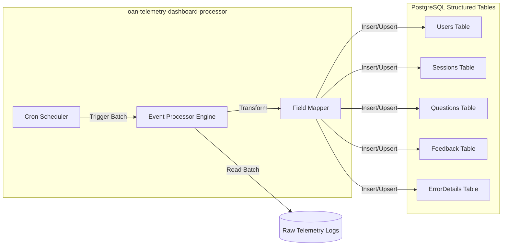

# oan-telemetry-dashboard-processor Technical Documentation

## 1. System Overview

**oan-telemetry-dashboard-processor** (internally "telemetry-log-processor") is a backend background microservice responsible for the **ETL (Extract, Transform, Load)** of telemetry data. It processes raw telemetry logs, transforming them into structured relational data optimized for querying by the Dashboard Service.

### Primary Objective
To asynchronously process high-volume raw telemetry events into organized tables (Users, Sessions, Questions, Feedback) to enable performant analytics and reporting.

---

## 2. Architecture & Design

The service operates as a **Background Worker**, utilizing scheduled tasks to process data in batches.

### Design Patterns
-   **ETL Pipeline**: Extracts raw logs, transforms JSON blobs into relational schemas, and loads them into specific tables.
-   **Dynamic Event Processing**: Uses a configuration-driven approach (`event_processors` table) to map event fields to database columns dynamically.
-   **Idempotency**: Ops are designed to be idempotent (using `ON CONFLICT DO UPDATE/NOTHING`) to handle re-processing safely.
-   **Seeding**: Includes logic to seed static data (e.g., `village_list`) on startup.

### Architecture Diagram



### Data Flow
1.  **Trigger**: `node-cron` triggers processing cycles based on `CRON_SCHEDULE`.
2.  **Extraction**: Fetches a batch of raw logs (likely from a `telemetry_logs` table or similar source).
3.  **Transformation**:
    -   **Event Routing**: Determines the event type (e.g., `OE_ITEM_RESPONSE`, `OE_START`).
    -   **Field Mapping**: Uses `eventProcessors.js` to map complex JSON paths (e.g., `edata.eks.target.questionText`) to flat DB columns.
    -   **Normalization**: Extracts common entities like Users and Sessions into their own tables.
4.  **Loading**: Performs SQL `INSERT` or `UPSERT` operations into the destination tables.
5.  **Tracking**: Updates a synchronization status (e.g., `sync_status`) to mark logs as processed.

---

## 3. Module/Component Breakdown

### Core Files
-   `index.js`: Service entry point. Sets up DB connection, runs migrations (`ensureTablesExist`), seeds data, and initializes cron jobs.
-   `eventProcessors.js`: Core logic for dynamic field mapping. defined how to traverse the JSON event structure to find values.
-   `seed_villages_stream.js`: A specialized script to seed the large `village_list` table efficiently.

### Key Components

| Component / Function | Responsibility | Logic |
| :--- | :--- | :--- |
| **`ensureTablesExist`** | Schema Migration. | Creates necessary tables (`questions`, `leaderboard`, `users`, etc.) if they don't exist logic. |
| **`processUserData`** | User Management. | Upserts user records based on `uid` or device fingerprint. Captures device metadata (OS, Browser). |
| **`processSessionStart`** | Session Tracking. | Creates session records. Links sessions to users. |
| **`registerEventProcessor`** | Dynamic Config. | Allows adding new event types and mappings at runtime without code changes. |

---

## 4. Key Logic & Algorithms

### Dynamic Field Mapping
The processor doesn't just hardcode all mappings. It uses a registry:
```javascript
// Example from code
registerProcessor(
  'OE_ITEM_RESPONSE', 
  'questions', 
  { 
    "questionText": "edata.eks.target.questionsDetails.questionText",
    ... 
  }
)
```
This allows the system to adapt to changing telemetry structures by updating the `event_processors` database table.

### User & Device Fingerprinting
The processor implements logic to identify users even if they are anonymous ("guest"):
1.  Checks for `fingerprint_details` in the event.
2.  If `uid` is missing or "guest", constructs a `uid` from `device_id` (`fp_<device_id>`).
3.  Stores granular device info (Browser, OS, Device Model) in the `users` table for analytics.

---

## 5. Database Schema

The processor manages the following key tables:
*   `questions`: Stores individual QA pairs.
*   `users`: Stores user profiles and device stats.
*   `sessions`: Stores session duration and metadata.
*   `feedback`: Stores user feedback.
*   `errorDetails`: Stores application errors.
*   `leaderboard`: Aggregated user scores (gamification).
*   `village_list`: Static geographical data for location mapping.

---

## 6. Dependencies

| Library | Purpose |
| :--- | :--- |
| **node-cron** | Task scheduling. |
| **pg** | PostgreSQL client. |
| **lodash** | Data manipulation (utilities like `_.get` for nested paths). |
| **stream-json** | Efficient JSON processing for large files (seeding). |
| **winston** | Logging. |
| **dotenv** | Config management. |

---

## 7. Setup & Usage

### Prerequisites
*   Node.js (v18+)
*   PostgreSQL instance (shared with Dashboard Service)

### Installation
1.  Navigate to the directory:
    ```bash
    cd oan-telemetry-dashboard-processor
    ```
2.  Install dependencies:
    ```bash
    npm install
    ```

### Configuration
Create/Edit `.env`:
-   `DB_HOST`, `DB_USER`, `DB_PASS`: Database credentials.
-   `BATCH_SIZE`: Number of logs to process per run (default 10).
-   `CRON_SCHEDULE`: Cron expression for processing frequency (default `*/5 * * * *`).

### Running the Service
*   **Development**:
    ```bash
    npm run dev
    ```
*   **Production**:
    ```bash
    npm start
    ```
